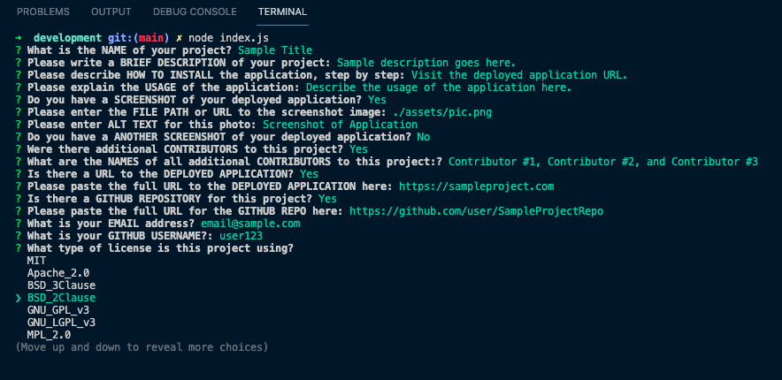
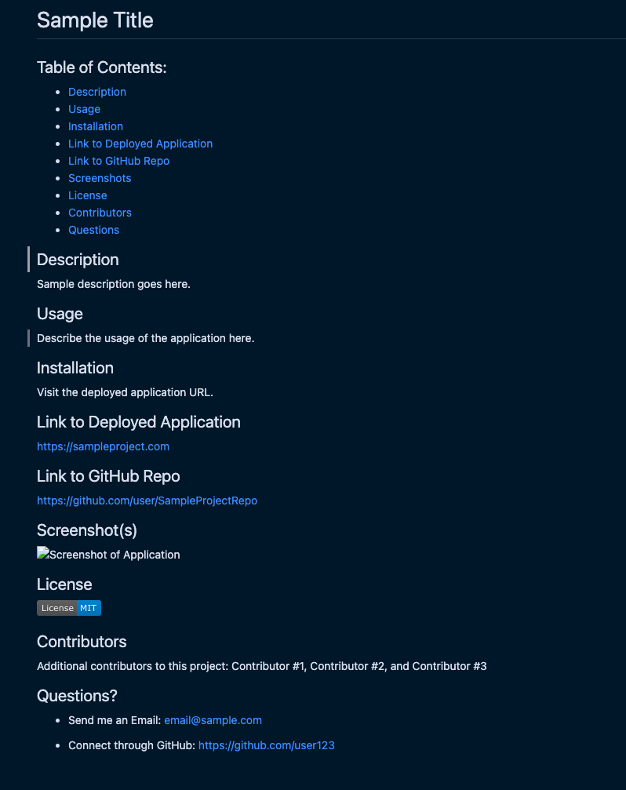

# README Generator

## Table of Contents:

- [Description](#description)
- [Usage](#usage)
- [Installation](#installation)
- [Link to GitHub Repo](#link-to-github-repo)
- [Screenshots](#screenshots)
- [License](#license)
- [Questions](#questions)

[](https://opensource.org/licenses/)

## Description

The purpose of this project is to provide a template to generate a professional README for any project.

## Usage

Create a professional README for every project quickly and easily with this README Generator. Follow the prompts for information about your project and the README will render with a working Table of Contents and your input organized cleanly.

## Installation

Clone down the repository from my GitHub to your local machine and run

```
node index.js
```

in the terminal once you change directories into the development folder.

## Link to GitHub Repo

https://github.com/mfandel118/README-Generator

## Screenshot(s)




## Questions

Marissa Fandel

- Email: mfandel118@gmail.com
- GitHub: https://github.com/mfandel118
