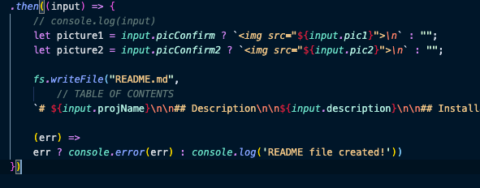
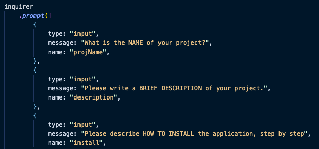

# Berley

## Table of Contents:

- [Description](#description)
- [Usage](#usage)
- [Installation](#installation)
- [Link to Deployed Application](#link-to-deployed-application)
- [Screenshots](#screenshots)
- [Contributors](#contributors)
- [Questions](#questions)
- [License](#license)

## Description

dslkfjghuq9345kjterdiugp9w35tjohgdapfkgjbep

## Usage

sjdgeiwusgbagkjzbosiuhgopiwghrgokndovjb

## Installation

- First\n\n* Second\n\n* Third

## Link to Deployed Application

https://mfandel118.github.io/Portfolio/

## Screenshot(s)

## Contributors

Additional contributors to this project: Berley & Bri

## Questions?

- Email: mfandel118@gmail.com

- GitHub Profile: https://github.com/mfandel118

## License

undefined
