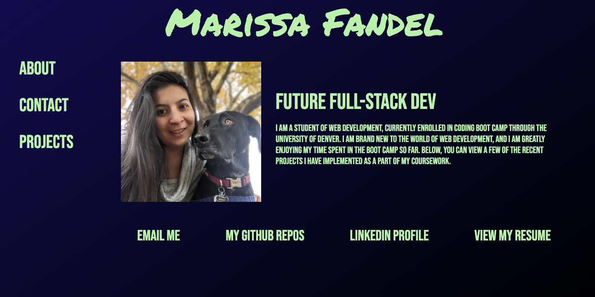

# Portfolio (README Generator Sample)

## Table of Contents:

- [Description](#description)
- [Usage](#usage)
- [Installation](#installation)
- [Link to Deployed Application](#link-to-deployed-application)
- [Link to GitHub Repo](#link-to-github-repo)
- [Screenshots](#screenshots)
- [Questions](#questions)

## Description

This project was created to display my skills as a web developer to potential employers.

## Usage

Users (potential employers) can use this Portfolio to see the work I have done on various applications & contact me.

## Installation

Navigate to my Portfolio using the URL to the deployed application.

## Link to Deployed Application

https://mfandel118.github.io/Portfolio/

## Link to GitHub Repo

https://github.com/mfandel118/Portfolio

## Screenshot(s)

## Questions

Any additional questions about this project? Please feel free to reach out:

- Name: Marissa Fandel
- Email: mfandel118@gmail.com
- GitHub: https://github.com/mfandel118

- Name: Sample Contributor #1
- Email: sample@email.com
- GitHub: https://github.com/user1234567

- Name: Sample Contributor #2
- Email: sample2@email.com

- Name: Sample Contributor #3
- GitHub: https://github.com/user12345678
